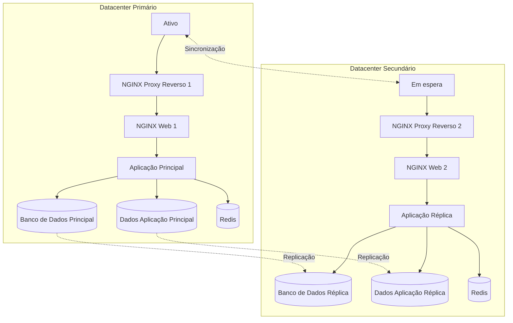

```mermaid
flowchart TB
    subgraph DC1[Datacenter Primário]
        LB1[Ativo] --> NGINX_PROXY1[NGINX Proxy Reverso 1]
        NGINX_PROXY1 --> NGINX_WEB1[NGINX Web 1]
        NGINX_WEB1 --> APP1[Aplicação Principal]
        APP1 --> DB1[(Banco de Dados Principal)]
        APP1 --> Replicação-Dados1[(Dados Aplicação Principal)]
        APP1 --> REDIS1[(Redis)]
    end

    subgraph DC2[Datacenter Secundário]
        LB2[Em espera] --> NGINX_PROXY2[NGINX Proxy Reverso 2]
        NGINX_PROXY2 --> NGINX_WEB2[NGINX Web 2]
        NGINX_WEB2 --> APP2[Aplicação Réplica]
        APP2 --> DB2[(Banco de Dados Réplica)]
        APP2 --> Replicação-Dados2[(Dados Aplicação Réplica)]
        APP2 --> REDIS2[(Redis)]
    end

    DB1 -.->|Replicação| DB2
    Replicação-Dados1 -.->|Replicação| Replicação-Dados2
    LB1 <-.->|Sincronização| LB2

```
