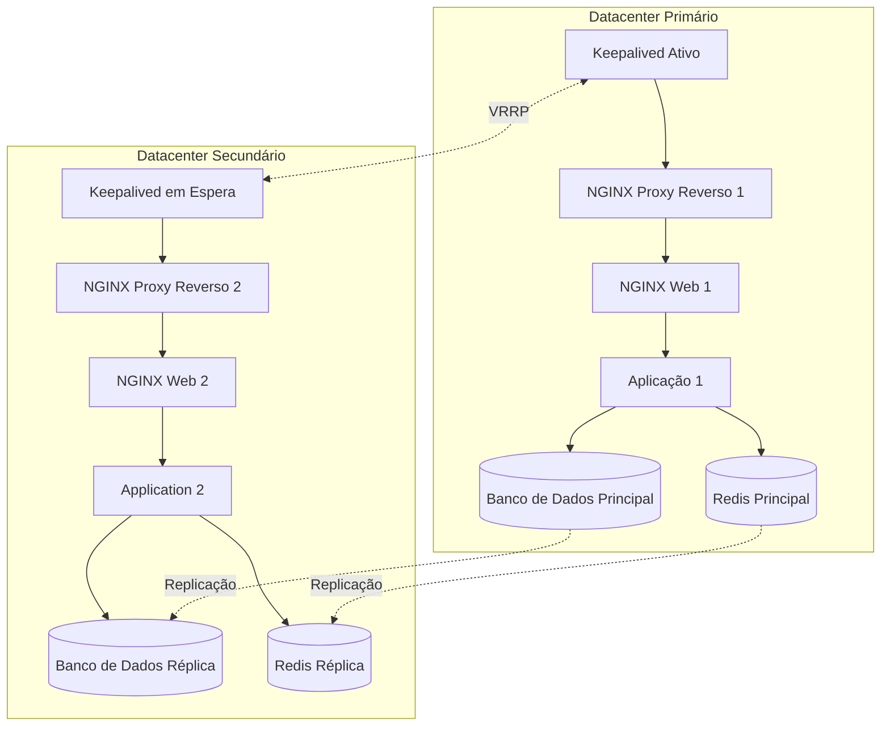

```mermaid
flowchart TB
    subgraph DC1[Datacenter Primário]
        LB1[Keepalived Ativo] --> NGINX_PROXY1[NGINX Proxy Reverso 1]
        NGINX_PROXY1 --> NGINX_WEB1[NGINX Web 1]
        NGINX_WEB1 --> APP1[Aplicação 1]
        APP1 --> DB1[(Banco de Dados Principal)]
        APP1 --> REDIS1[(Redis Principal)]
    end

    subgraph DC2[Datacenter Secundário]
        LB2[Keepalived em Espera] --> NGINX_PROXY2[NGINX Proxy Reverso 2]
        NGINX_PROXY2 --> NGINX_WEB2[NGINX Web 2]
        NGINX_WEB2 --> APP2[Application 2]
        APP2 --> DB2[(Banco de Dados Réplica)]
        APP2 --> REDIS2[(Redis Réplica)]
    end

    DB1 -.->|Replicação| DB2
    REDIS1 -.->|Replicação| REDIS2
    LB1 <-.->|VRRP| LB2

```
