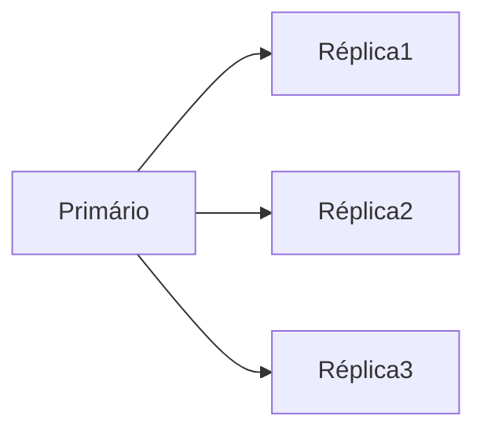
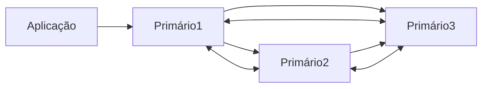

# Banco de dados
- A seguir são descritos os bancos de dados suportados pela aplicação.
- Dois cenários serão testados: 
- 1) cluster em alta disponibilidade (mínimo 3 nós)
- 2) cluter de replicação Primário/Secundário (mínimo 3 nós)

## Versões suportadas
- MySQL 8.0 / 8.4 or MariaDB 10.6/ 10.11 (recomendado) / 11.4
- Oracle Database 11g, 18, 21, 23 (somente versão enterprise)
- PostgreSQL 13/14/15/16/17

- Serão utilizados exemplos com MariaDB e Postgres para a criação das réplicas dos bancos de dados.

## Criação de réplica do banco de dados
- Tanto MariaDB quanto Postgres possuem a possiblidade de criar réplicas do banco.
- As réplicas devem ser do tipo Ativo-Ativo, de maneira que todas alterações no Primário reflitam no banco Secundário, que estará em Stand-By caso o Primário venha a falhar.


### Réplica Assícrona
- Nessa arquitetura, todas modificações realizadas no primário serão refletidas nas réplicas.
- Quando houver uma fala no primário, uma das réplicas deve assumir como primário.



## Réplica Síncrona
- Na réplica síncrona, todas modificações realizadas em um banco de dados são replicadas para outros servidores.
- Sendo assim, teremos uma réplica do mesmo banco de dados em todos os servidores.
- Caso haja alguma inconsistência de dados em algum dos servidores, ele será excluído do `cluster`.




## MariaDB
- Possiblidade de criar clusters utilizando o Galera MariaDB. Além disso, possui um [gerenciador gráfico](https://galeracluster.com/galera-mgr/).


## Postgres
- A replicação de bancos Postgres pode ser feita utilizando o [postgresql_cluster v2.0](https://www.postgresql.org/about/news/postgresql_cluster-v20-multi-cloud-postgresql-ha-clusters-free-open-source-2939/) ou algum dessa lista [aqui](https://www.postgresql.org/download/products/3-clusteringreplication/).
- Será utilizado o Patroni, o qual é um conjunto de scripts em python que automatizam o gerenciamento de falhas em clusters.

### Patroni
#### Configuração de Cluster Standby entre Data Centers
- Para fazer o cluster do Patroni do datacenter 1 para o datacenter 2, será utilizada a característica Standby Cluster. 
- Segundo a documentação:
    - É um cluster que não tem nenhum nó Postgres primário em execução (nenhum membro de leitura/gravação).
    - Esses clusters replicam dados de outro cluster e são úteis para replicação entre data centers.
    - Haverá um líder no cluster (um standby) responsável por replicar as alterações de um nó Postgres remoto.
    - Os outros standbys serão configurados com replicação em cascata a partir desse líder.

- Observação: O cluster standby não conhece o cluster de origem e pode usar restore_command ou um DCS (etcd, consul) independente.

- Existem configurações que são realizadas apenas na inicialização do cluster. Estas estão na seção `bootstrap` do arquivo `postgres0.yml`
- Se necessário alterar alguma configuração após, utilizar o comando `patronictl edit-config`.

#### Configuração
- Para fazer a instalação é possível utilizar o role do ansible chamado `patroni`, o qual está no diretório `roles`. 

##### Comandos úteis
- Acessar e listar cluster: `docker exec patroni1 patronictl list`
- Mostre as mudanças a cada 2 segundos: `docker exec patroni1 patronictl list -W`


##### Gerenciamento de Falhas
- Se um membro falhar:
    - Não reinicie o PostgreSQL diretamente. Use patronictl ou a API REST.
    - Apenas o Patroni deve gerenciar o PostgreSQL.

- Exemplo de cluster com falha:
```bash
+ Cluster: nome-do-cluster (7483271224010649624) --------+----+-----------+
| Member   | Host       | Role    | State        | TL | Lag in MB |
+----------+------------+---------+--------------+----+-----------+
| patroni1 | 172.23.0.5 | Leader  | running      | 91 |           |
| patroni2 | 172.23.0.6 | Replica | starting     |    |   unknown |
| patroni3 | 172.23.0.3 | Replica | start failed |    |   unknown |
+----------+------------+---------+--------------+----+-----------+
```

- É possível reiniciar o membro que está com falha com o seguinte comando:
`patronictl restart nome-do-cluster membro --scheduled now --force`

- Também é possível reconstruir o membro que está em `standby`:
`patronictl reinit nome-do-cluster membro --force`

###### Informações do Cluster
- Ver versão do Patroni: `patronictl version cluster`
- Ver status de um membro: `docker compose exec patroni1 curl http://172.23.0.3:8008`
- Tirar o cluster do modo de manutenção: `docker compose exec patroni1 patronictl resume`
- Mostrar as configurações dinâmicas: `docker compose exec patroni1 show-config`

###### Monitoramento
- O Patroni expõe endpoints úteis na API REST:
    - /metrics: Métricas no formato Prometheus.
    - /patroni: Status do cluster em JSON.

- Esses endpoints são utilizados para implementar verificações de monitoramento.

###### Teste de failover
- Quando o cluster está saudável, é possível realizar um teste de failover:
`patronictl switchover nome-do-cluster --leader líder-atual --candidate novo-candidato-a-lider`

###### Backup e Restauração
- Para backup do banco de dados utilizamos o utilitário `pg_dumpall`:
`docker exec patroni1 pg_dumpall -c -U postgres >  dump.sql`

- Para importar utilizamos o utilitário `pg_restore`:
`docker exec patroni1 pg_restore -C -j 4 dump.sql`

###### Resolução de problemas
- 1) Cluster sem líder
- Solução: forçar a eleição de um líder.
`patronictl failover nome-do-cluster --candidate candidato-a-lider --force`


