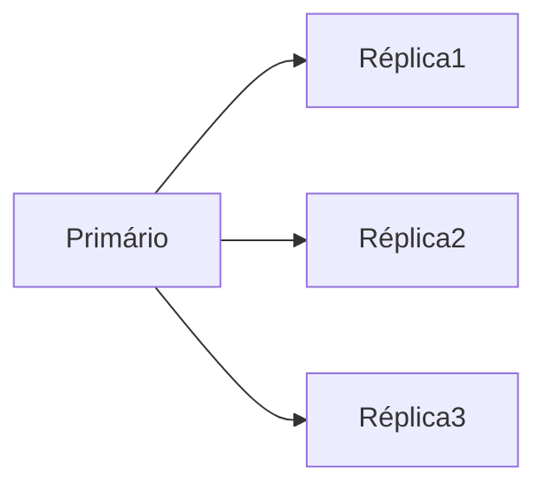
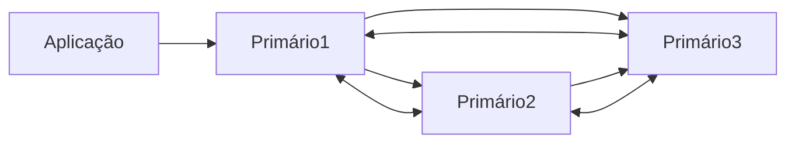

# Banco de dados
- A seguir são descritos os bancos de dados suportados pela aplicação.
- Dois cenários serão testados: 
- 1) cluster em alta disponibilidade (mínimo 3 nós)
- 2) cluter de replicação Primário/Secundário (mínimo 3 nós)

## Versões suportadas
- MySQL 8.0 / 8.4 or MariaDB 10.6/ 10.11 (recomendado) / 11.4
- Oracle Database 11g, 18, 21, 23 (somente versão enterprise)
- PostgreSQL 13/14/15/16/17

- Serão utilizados exemplos com MariaDB e Postgres para a criação das réplicas dos bancos de dados.

## Criação de réplica do banco de dados
- Tanto MariaDB quanto Postgres possuem a possiblidade de criar réplicas do banco.
- As réplicas devem ser do tipo Ativo-Ativo, de maneira que todas alterações no Primário reflitam no banco Secundário, que estará em Stand-By caso o Primário venha a falhar.

### Réplica Assícrona
- Nessa arquitetura, todas modificações realizadas no primário serão refletidas nas réplicas.
- Quando houver uma fala no primário, uma das réplicas deve assumir como primário.

## Réplica Síncrona
- Na réplica síncrona, todas modificações realizadas em um banco de dados são replicadas para outros servidores.
- Sendo assim, teremos uma réplica do mesmo banco de dados em todos os servidores.
- Caso haja alguma inconsistência de dados em algum dos servidores, ele será excluído do `cluster`.

## MariaDB
- Possiblidade de criar clusters utilizando o Galera MariaDB. Além disso, possui um [gerenciador gráfico](https://galeracluster.com/galera-mgr/).

## Postgres
- A replicação de bancos Postgres pode ser feita utilizando o [postgresql_cluster v2.0](https://www.postgresql.org/about/news/postgresql_cluster-v20-multi-cloud-postgresql-ha-clusters-free-open-source-2939/) ou algum dessa lista [aqui](https://www.postgresql.org/download/products/3-clusteringreplication/).
- Será utilizado o Patroni, o qual é um conjunto de scripts em python que automatizam o gerenciamento de falhas em clusters.

### Replicação nativa
- Consulte a documentação [aqui](postgres-replica.md) para fazer a réplica do postgres manualmente.

### Replicação com Patroni
- Patroni é um template desenvolvido para garantir alta disponibilidade de um cluster postgres.
- Confira [aqui](patroni.md) a documentação.

