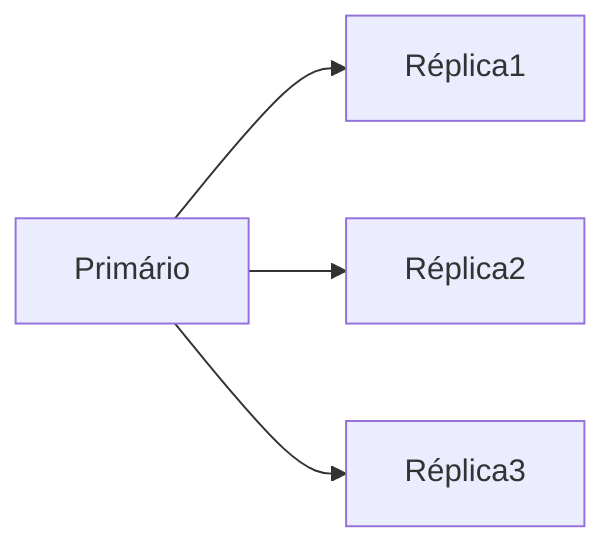
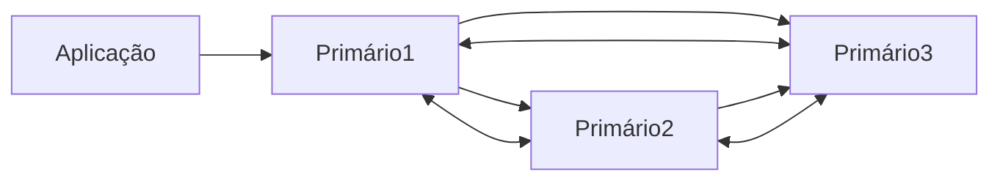

# Banco de dados
- A seguir são descritos os bancos de dados suportados pela aplicação.
- Dois cenários serão testados: 
- 1) cluster em alta disponibilidade (mínimo 3 nós)
- 2) cluter de replicação Primário/Secundário (mínimo 3 nós)

## Versões suportadas
- MySQL 8.0 / 8.4 or MariaDB 10.6/ 10.11 (recommended) / 11.4
- Oracle Database 11g, 18, 21, 23 (only as part of an enterprise subscription)
- PostgreSQL 13/14/15/16/17

- Serão utilizados ou MariaDB ou Postgres para a criação das réplicas dos bancos de dados.

## Criação de réplica do banco de dados
- Tanto MariaDB quanto Postgres possuem a possiblidade de criar réplicas do banco.
- As réplicas devem ser do tipo Ativo-Ativo, de maneira que todas alterações no Primário reflitam no banco Secundário, que estará em Stand-By caso o Primário venha a falhar.


### Réplica Assícrona
- Nessa arquitetura, todas modificações realizadas no primário serão refletidas nas réplicas.
- Quando houver uma fala no primário, uma das réplicas deve assumir como primário.



## Réplica Síncrona
- Na réplica síncrona, todas modificações realizadas em um banco de dados são replicadas para outros servidores.
- Sendo assim, teremos uma réplica do mesmo banco de dados em todos os servidores.
- Caso haja alguma inconsistência de dados em algum dos servidores, ele será excluído do `cluster`.




## MariaDB
- Possiblidade de criar clusters utilizando o Galera MariaDB. Além disso, possui um [gerenciador gráfico](https://galeracluster.com/galera-mgr/).


## Postgres
- A replicação de bancos Postgres pode ser feita utilizando o [postgresql_cluster v2.0](https://www.postgresql.org/about/news/postgresql_cluster-v20-multi-cloud-postgresql-ha-clusters-free-open-source-2939/) ou algum dessa lista [aqui](https://www.postgresql.org/download/products/3-clusteringreplication/).


### postgres no docker swarm
docker network create --driver overlay postgres
docker network create --driver overlay reverse-proxy

- Crie um arquivo .env
- Crie o docker-compose.yml:
```
version: '3.8'

# Redes externas (overlay) que devem ser criadas no Docker Swarm
networks:
  postgres:
    external: true
    name: postgres
  reverse-proxy:
    external: true
    name: reverse-proxy

# Serviços que serão implantados
services:
  # Serviço do PostgreSQL
  postgres:
    container_name: postgres-postgres-1
    image: postgres:17-alpine  # Imagem do PostgreSQL com Alpine Linux
    restart: always  # Reiniciar automaticamente em caso de falha
    volumes:
      - ./volumes/postgres/data:/var/lib/postgresql/data  # Volume para persistência dos dados
      - ./.docker/postgres/init-user-db.sh:/docker-entrypoint-initdb.d/init-user-db.sh  # Script de inicialização do banco de dados
      # - ./volumes/postgresql.conf:/etc/postgresql/postgresql.conf  # Configuração personalizada do PostgreSQL (opcional)
    networks:
      - postgres  # Conecta à rede overlay 'postgres'
    environment:
      - POSTGRES_PASSWORD=${POSTGRES_PASSWORD}  # Senha do superusuário do PostgreSQL
      - POSTGRES_DB=${POSTGRES_DB}  # Nome do banco de dados inicial
      - POSTGRES_USER=${POSTGRES_USER}  # Nome do usuário inicial
      - TZ=${TZ}  # Fuso horário
    deploy:
      replicas: 1  # Número de réplicas (para alta disponibilidade, aumente este número)
      placement:
        constraints:
          - node.role == manager  # Executar apenas no nó manager (opcional)
```

- docker stack deploy -c docker-compose.yml postgres-cluster


