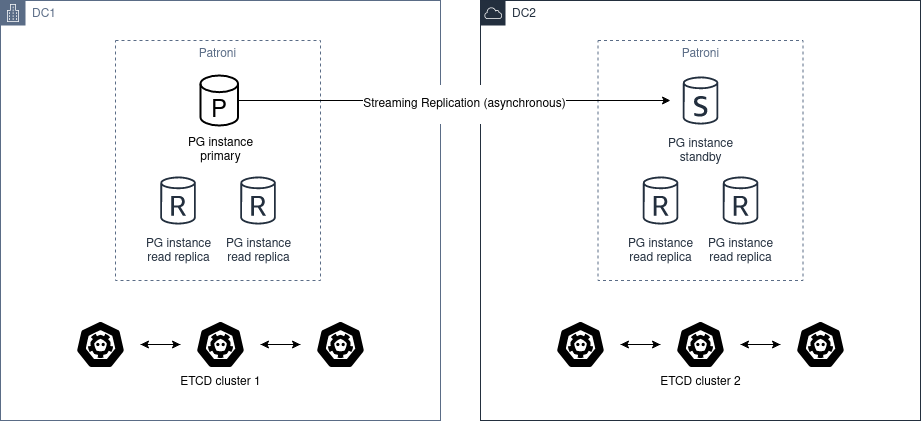
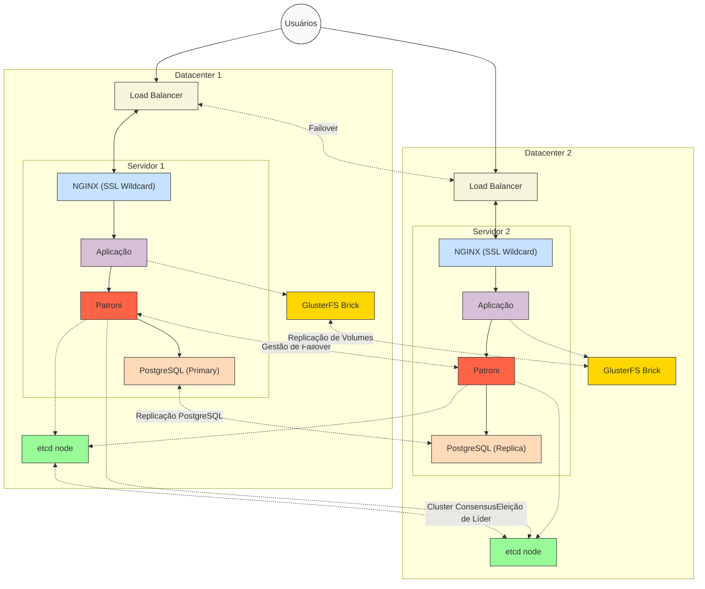
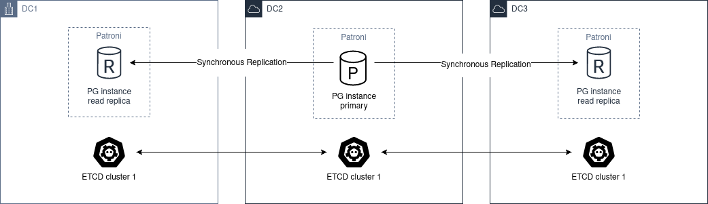

# início()
- Este documento visa trazer consderações sobre ambientes distribuídos e a aplicação Nextcloud.

## Nextcloud em ambientes distribuídos
- Nextcloud é uma aplicação que precisa de, no mínimo, 1) armazenamento de arquivos, 2) banco de dados, 3) servidor web, 4) linguagem de interpretação (PHP).
- Em se tratando de sincronização de dados, após realizar pesquisas, optamos por realizar testes com GlusterFS e GarageS3.
- GlusterFS foi escolhido por sua natureza descentralizada, diferentemente do CEPH que armazena os meta-dados num servidor centralizado. Além disso, ambas tecnologias apresentam maturidade desejável.
- GarageS3 foi escolhido por sua natureza inovadora, de maneira a prover um software capaz de poder ser utilizado em hardware de baixo custo/não confiável e por ter uma natureza distribuída como princípio.
- o software MinIO não foi escolhido pois não possuí natureza distribuída.  
- Visto que o Nextcloud tem a opção utilizar *buckets* como armazenamento primário. Poderia se utilizar o provedor de armazenamento em nuvem Wasabi, o qual oferece a possibilidade de replicar os *buckets* em diferentes regiões. Todavia o mesmo provedor não oferece serviços no Brasil.

- Outro aspecto a ser levado em conta é o banco de dados: é necessário fazer a replicação em tempo real.
- Existem soluções como MariaDB Gallera Cluster e Autobase que fornecem uma interfáce gráfica para fazer a instalação e configuração de novos clusters.
- Todavia essa instalação (a que ocorre pela interface gráfica) é feita com a instalação direto no sistema operacional, sem a utilização de containers.
- Optou-se por utilizar o Patroni, o qual é um template para clusters de Postgres.

- Quando fala-se de sistema distribuído, é necessário a utilização de ferramentas como o etcd, o qual é um armazenamento chave-valor distribuído e altamente disponível, amplamente utilizado em sistemas distribuídos para armazenamento de configurações compartilhadas, descoberta de serviços e coordenação entre nós. 
- O etcd atua em conjunto com o Patroni, de maneira a garantir que a aplicação apenas escreva no servidor primário.

- A topologia com dois datacenters para fazer o cluster de banco de dados fica da seguinte maneira:

[Fonte](https://patroni.readthedocs.io/en/latest/ha_multi_dc.html)

## Configurações necessárias a nível de DNS:
    1) Entrada tipo A apontando para o IP da aplicação
    2) Provedor de DNS sem suporte a certificados *wildcard*
    3) Provedor de DNS com suporte a certificados *wildcard*

- Caso o provedor não suporte certificados *wildcard*, será necessário, quando a aplicação no Datacenter primário estiver comprometida, adicionar o IP do servidor 2 à entrada tipo A existente.
- Se o provedor DNS suportar certificados *wildcard*, o mesmo deverá ser copiado para os demais servidores após a requisição no servidor 1.

## Balanceamento de carga em ambientes distribuídos
- Por se tratar de um setup primário/secundário, o balanceamento de carga entre datacenters não será habilitado.
- O que pode ser habilitado é o balanceamento de carga dentro de cada datacenter em questão, a depender dos recursos computacionais disponíveis.

## Banco de dados distribuídos
- É possível utilizar MySQL, MariaDB ou Postgres. 
- Optou-se por utilizar o gerenciador de alta disponiblidade Patroni o qual implementa o Postgres.
- Outra alternativa seria utilizar o Galera Manager ou o Autobase. Ambos estão ducumentados mas optou-se pelo Patroni por sua simplicidade e flexibilidade.

## Ferramentas para backup e recuperação em caso de desastres
- A ferramenta utilizada para backup (em servidor diferente do cluster) é o Duplicati.

## Soluções de armazenamento de backup
- O provedor Wasabi é o escolhido para armazenamento em objetos. De maneira que o backup será criptografado, não há problema em utilizar provedor externo.
- A única ressalva é a latência do link de internet para restaurar o backup, o que pode demorar.

## Ferramentas para monitoramento da infraestrutura
- A ferramenta Zabbix será utilizada afim de monitorar a infraestrutura.
- Outras utilitários de linha de comando também podem ser utilizados, tais quais: `gluster, patronictl, etcdctl` entre outros.
- Está em análise utilizar a ferramenta `Percona Monitoring Management` para análise do banco de dados.

## Ferramentas para verificação da integridade da instalação
- GlusterFS, Patroni, etcd, Nextcloud possuem ferramentas de linha de comando para verificar seu status.
- Serão incorporados ao Zabbix para monitoramento.

## Levantamento de ferramentas para infraestrutura como código
- No cenário atual é utilizado Proxmox como virtualizador, logo, poder-se-ia utilizar a ferramenta OpenTofu para instanciar novas máquinas.
- Será utilizado o Ansible para automatizar tarefas.

## Ferramentas de interconexão utilizando redes definidas por software
- Em estudo se será necessário.

## Diagramação da arquitetura proposta
- Abaixo está o diagrama da arquitetura proposta.

## Considerações
- Utilizando 2 data centers para a redundância requer intervenção manual para fazer a ativação do servidor secundário. Isso ocorre pois com apenas 2 nós não é possível utilizar o etcd para fazer a eleição de um líder. 

- Ambiente com alta disponibilidade em 3 data centers.

[Fonte](https://patroni.readthedocs.io/en/latest/ha_multi_dc.html)