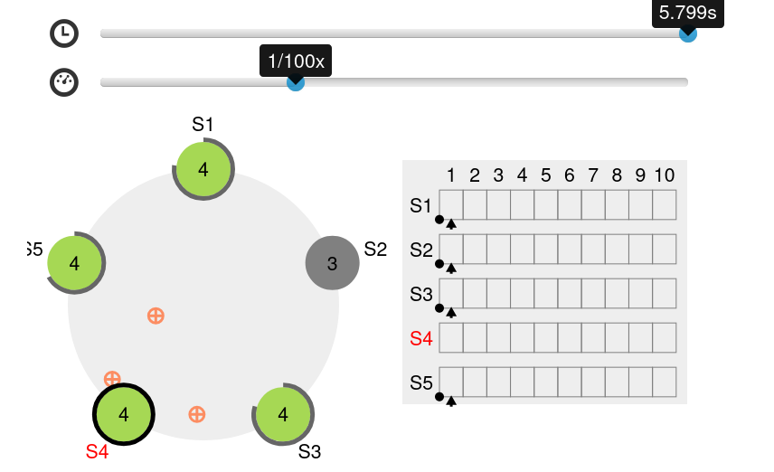

# etcd
- O etcd é um repositório de chave-valor confiável e distribuído para os dados mais críticos de um sistema distribuído, com foco em:

Simples: API bem definida e voltada para o usuário (gRPC)
Seguro: TLS automático com autenticação opcional por certificado de cliente
Rápido: benchmark de 10.000 gravações/seg
Confiável: distribuído corretamente usando Raft

- O etcd é escrito em Go e usa o algoritmo de consenso Raft para gerenciar um banco de dados chave/valor replicado de alta disponibilidade.

# história
**2013-06**
Commit Inicial,
Contribuição da CoreOS

**2014-06**
Kubernetes V0.4,
10x comunidade

**2015-02**
Primeira Versão Estável do etcd V2.0,
Protocolo de consistência Raft,
1.000 escritas/segundo

**2017-01**
Novas APIs,
Proxy gRPC de leitura linearizada rápida

**2018-11**
Incubação CNCF,
30+ projetos usando etcd,
400+ grupos de contribuição,
9 mantenedores de 8 empresas

**2019**
etcd V3.4,
Membro "Learner",
Leitura totalmente concorrente,
Melhorias de desempenho

# Algoritmo raft
- Raft é um algorítmo de consenso distribuído, ou seja, ele garante que os dados sejam replicados com consistência num sistema distribuído.
- Consiste em três partes principais:
    1. Eleição de Líder: um dos nós do sistema é eleito como líder e todos seguem o mesmo. Ele quem controla as operações de escrita no sistema. Isso evita que um nó que está em espera processe dados, por exemplo.
    2. Replicação de Logs: todas as mudanças no estado do sistema são registradas em log e replicado em todos os nós. O líder é responsável por replicar os logs e garantir que todos os nós estejam atualizados, o que simplifica o gerenciamento e facilita o entendimento.
    3. Segurança da Eleição: apenas um líder pode ser eleito a qualquer momento. Um novo líder é eleito se o líder falhar.

## Processo de eleição
- Inicialmente todos nós se encontram em estado de eleição, quando os mesmos estão sem um líder. Sempre que não há lider ocorre um processo de eleição.
- O processo de eleição envolve os seguintes estágios:
  - Candidatura: nó solicita votos de outros nós. Apenas um voto por eleição é possível.
  - Votação: Se o nó não votou ainda nesta eleição, concede seu voto ao nó que achar legítimo.
  - Eleição de líder: ganha a eleição o nó que tiver a maioria dos votos. 

- No seguinte (endereço)[https://raft.github.io] é possível observar a simulação de como o protocolo raft funciona em um cluster.
- Faça o seguinte teste: exclua um dos membros do cluster e observe o que acontece.

- Uma decisão só é considerada válida se ela tem um *quorum*, ou seja, tem a maioria dos votos.
- Ou seja, são necessários no mínimo 3 nós para garantir alguma tolerância a falhas.
- A seguinte fórmula pode ser aplicada: ** ToleranciaFalhas = (Número de nós) - (Tamanho do quorum) **

