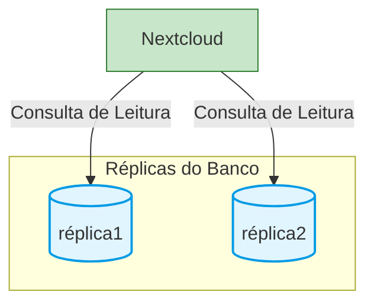

### Banco de dados
- Opções a serem testadas:

#### Réplicas de leitura apenas
- Especifica réplicas do banco de dados para servirem apenas de leitura.
```bash
/**
 * Specify read-only replicas to be used by Nextcloud when querying the database
 */
'dbreplica' => [
	['user' => 'nextcloud', 'password' => 'password1', 'host' => 'replica1', 'dbname' => ''],
	['user' => 'nextcloud', 'password' => 'password2', 'host' => 'replica2', 'dbname' => ''],
],
```



#### Dump da tabela dos usuários
- docker exec -t mysql-mysql-1 /usr/bin/mariadb-dump -u root -pSENHA nextcloud oc_users > users.sql
- Nota: se importando de mysql para postgres, tire os `` do nome da tabela ao importar a tabela.
- Por exemplo: 
- INSERT INTO `oc_users` se torna INSERT INTO oc_users **

#### Importando a tabela de usuários
- docker exec -i postgres-postgres-1 psql -U postgres -d nextcloud < users.sql