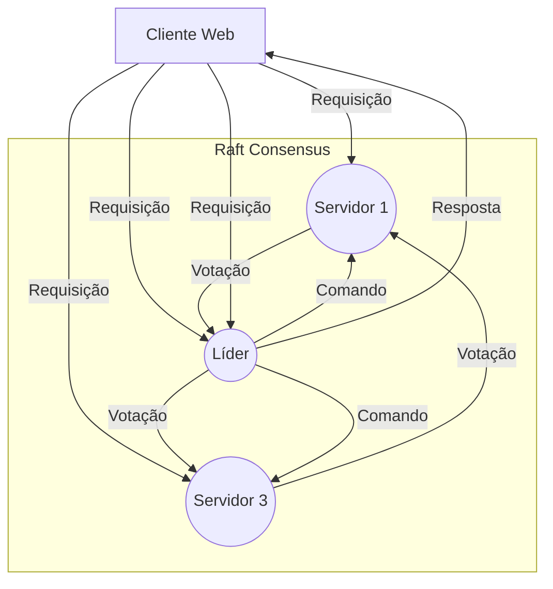

# Proxy reverso
- Um proxy reverso é utilizado para ser o ponto de entrada para as aplicações que estão "atrás" do mesmo. 

- Pode ter as seguintes características:
    * requisitar certificados válidos
    * encaminhar corretamente as requisições às aplicações
    * cache de conteúdo
    * centralização do monitoramento
    * balanceamento de carga
    * alta disponibilidade

- Antes de configurar um ambiente em alta disponibilidade, certifique-se de ter configurado os registros DNS apropriadamente.
- Para garantir alta disponibilidade, é possível utilizar os seguintes softwares:

## Nginx-proxy
- Para a implementação de um proxy reverso, o [nginx-proxy](https://github.com/LibreCodeCoop/nginx-proxy) é uma solução popular e eficiente, especialmente em ambientes baseados em contêineres. 
- Ele automatiza a configuração do Nginx, detectando contêineres em execução e adicionando as configurações de proxy reverso dinamicamente. Isso simplifica enormemente o gerenciamento de múltiplos serviços e subdomínios, pois o Nginx-proxy se encarrega de atualizar suas configurações sempre que um novo contêiner é iniciado ou parado.

## Ferramentas para verificar que um servidor ficou indisponível
- Em se tratando de um cluster de uma determinada aplicação, um cenário possível é haver uma votação para eleger quem responderá as solicitações dos usuários.
- O gráfico abaixo demonstra um exemplo utilizando o algoritmo "raft concensus".

- Consenso é algo necessário e fundamental em sistemas distribuídos tolerantes a falhas. O consenso envolve múltiplos servidores concordando com os valores propostos.
- Para atingir esse objetivo, é possível configurar um script e personalizar o funcionamento, a depender do cenário e tecnologias desejadas:
- Cada servidor deve rodar uma cópia do script
- Cada um monitora constantemente o outro servidor através de conexões TCP, trocando informações de status entre si para saber quem é primário/secundário, além de testes de integridade
- Como ocorre a detecção de falhas: 
    a) Se um servidor não consegue se comunicar com o outro; 
    b) Se as respostas demoram muito (timeout)
    c) Se há erros nas comunicações (perda de pacotes)

- É necessário fazer um gerenciamento de papéis definindo automaticamente quem é primário/secundário
- Não pode haver conflito (ambos primários ou secundários), por isso a necessidade de uma eleição
- Mantém o estado salvo em arquivo para persistência entre reinicializações

- Se o servidor primário falha, o secundário assume automaticamente
- Quando o primário original volta, o sistema pode retornar ao estado inicial após verificações de integridade

