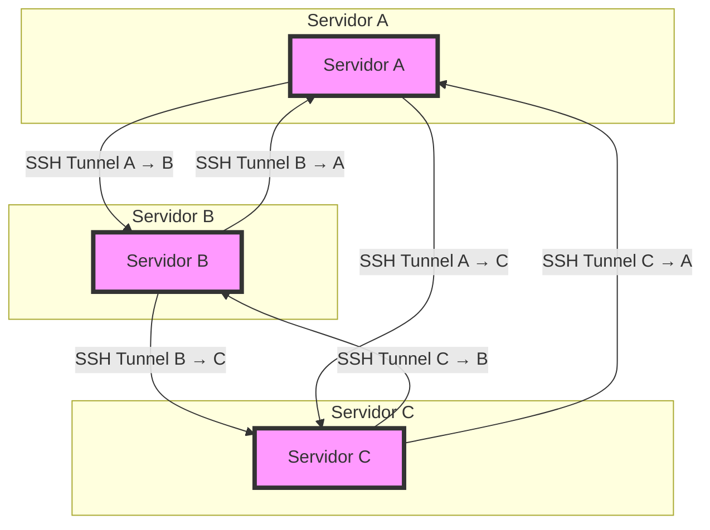
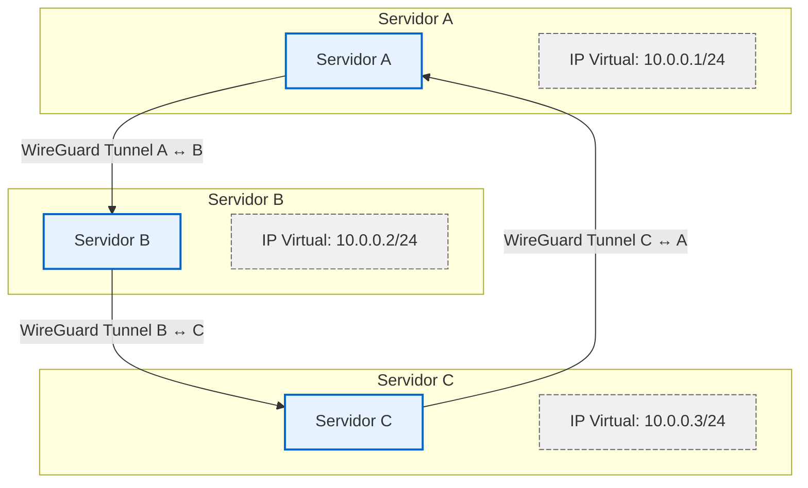

# Interconexão entre instâncias
- A comunicação entre os servidores pode ser feita utilizando ferramentas do cotidiano como o `Secure Shell`, ou `WireGuard`, entreanto, não proveem uma interface gráfica para facilidade na gerência de acessos e apresentam uma topologia centralizada, apresentando um único ponto de falha.
- Essa segurança extra é para as conexões entre as instâncias quanto para o acesso de gerenciamento das mesmas.


## Opções disponíveis
- SSH
- Wireguard
- Tailscale
- Zerotier
- Nebula
- DefGuard
- Strongswan


### SSH
- Utilizando SSH e tuneis reversos, é possível fazer uma arquitetura que interconecte os servidores.
- Na maneira diagramada abaixo, tanto o servidor inicia uma conexão quanto recebe uma.



### Wireguard
- É possível realizar a mesma arquiteturacom o Wireguard.
- Para automatizar a distribuição dos arquivos de configurações entre os hosts, utiliza-se esse [projeto](https://github.com/k4yt3x/wg-meshconf)



### Zerotier
- Zerotier é uma solução de rede definida por software e VPN. Segundo informações no site:
    ```bash
    ZeroTier é um switch Ethernet programável inteligente para o planeta Terra. 
    Ele permite que todos os dispositivos em rede, VMs, contêineres e aplicativos se comuniquem como se todos residissem no mesmo data center físico ou região de nuvem.
    ```
- O agente que é instalado nas máquinas é responsável por escolher o melhor caminho até o destino.
- Por exemplo, se duas máquinas na mesma rede estiverem na mesma rede do zerotier, elas serão acessíveis diretamente, sem trafegar pela internet.
- Para adicionar os nós na rede, é possível utilizar o controlador da fabricante ou [forks da mesma](https://github.com/sinamics/ztnet)


### Tailscale
- Oferece uma solução Web mais amigável para gerência dispositivos. Executa o protocolo Wireguard.

